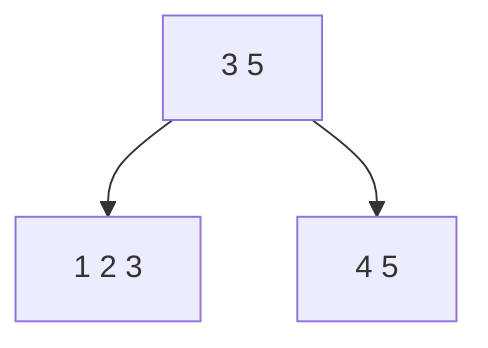

```
规范化与反规范化
索引与视图
分布式数据库
NoSQL
内存数据
```

# 数据库设计
## 逻辑数据模型设计过程
* 构建系统上下文数据模型，包含实体及实体之间的联系
* 绘制基于主键的数据模型，为每个实体添加主键属性
* 构建全属性数据模型，为每个实体添加非主键属性
* 利用规范化技术建立系统规范化数据模型

* 转化为数据模型
* 关系规范化
* 模式优化
* 设计用户子模式

## 数据库设计关注的问题
* 性能：查询/修改
  * 规范化（表格尽可能简洁，减少冗余）：查询慢，修改快。
  * 多查询，少修改：反规范化/索引/分布式数据库/读写分离
    * 通过增加数据冗余，提高查询效率（用空间换时间）。会带来数据一致性问题
* 数据一致性
  * 一次一起写：应用程序/数据库插件
  * 联动修改：触发器
  * 后续修改：批处理
* 安全

## 数据库的性能优化
* 集中式
  * 硬件：CPU，内存，I/O（硬盘、阵列），网络
  * 系统软件：参数，如进程优先级，CPU使用权，内存使用
  * 数据库设计
    * 分区、分表、分库
    * 物化视图：多查询，少修改
    * 索引：常查询——建索引，常修改——避免索引
    * SQL优化
      * 以不相干子查询代替相干子查询
      * 只检索需要的列
      * 用带IN的条件子句等价替换OR
      * 经常提交COMMIT，以尽早释放锁
      * 尽可能减少多表查询
  * 应用软件：数据库连接池（连接数据库时优化连接方式）
* 分布式：除了集中式之外的优化，还有：
  * 通信代价
    * 全局查询树的变换
    * 多副本策略
    * 查询树的分解
    * 半连接与直接连接
   
## 规范化与反规范化
* 规范化：细粒度；影响查询性能；根据业务场景反规范化
* 反规范化：连接操作少，检索快，统计快，需要查的表减少，检索容易
  * 方式
    * 增加派生冗余列
    * 增加其他冗余列
    * 重新组表
    * 分割表：把用户表做水平分割，例如按地域分割
  * 缺点
    * 数据冗余，需要更大的存储空间——无解
    * 插入、更新、删除操作开销大——无解
    * 数据不一致，可能产生添加、修改、删除异常——触发器同步；应用程序同步
    * 更新和插入代码编写难度高——无解
## 索引与视图

### 索引
> 提升查询效率，降低添加、修改、删除效率；采用B树，B+树等。

B+树：将下层的最大值传到上层

* 关系的3种类型
  * 基本关系（基本表/基表）：实际存在的表，实际存储数据的逻辑表示
  * 查询表：查询结果对应的表
  * 视图表：由基表或其他视图导出的表，本身不独立存储，数据库只存放它的定义，常称它为虚表。它是一个虚拟表，内容由查询定义（仅保存SQL查询语句）。同真实的表一样，视图包含一系列带有名称的列和行数据。但是，视图并没有真正存储它们，而是通过查询原始表动态生成所需要的数据。
 
### 视图
> 不能提高性能
* 优点
  * 简化用户操作
  * 使用户以不同的方式查询同一数据
  * 对数据库重构提供了一定程度的逻辑独立性
  * 对机密的数据提供安全保护

* 物化视图：将视图的内容物理存储起来，其数据随原始表变化，同步更新。（可以提高查询性能）
> 它不是传统意义上的虚拟视图，是实体化的视图，其本身会存储数据。当原始数据更新时它也会同步更新。

## 分布式数据库
分区（不同的磁盘区域），分表，分库

* 分区：逻辑上还是一张表
* 分表：逻辑上是多张表

相同点：都针对数据表；都使用了分布式存储；都提升查询效率；降低数据库频繁I/O压力值。

### 分区
> 只有水平方向（表结构不变）

* 范围：比如<500
* 哈希：尽可能均匀
* 列表：比如按照 R0 == "value"

策略
分区策略|分区方式|说明
---|---|---
范围分区【RANGE】|按照数据范围分区|例，按用户编号分区：0-9999映射到分区A；10000-99999映射到分区B...
散列分区【HASH】|通过key进行hash运算分区|例，把数据分配到不同分区，类似于取余操作，余数相同的放在一个分区
列表分区【LIST】|根据某字段的具体取值进行分区|例，长沙用户分到同一区，北京分到同一区等。

优点
* 相对于单个文件系统或硬盘，分区可以存储更多数据。
* 数据管理比较方便。比如要清理或废弃某年的数据，可以直接删除该日期的分区数据。
* 精准定位分区查询数据，不需要全盘扫描查询，大大提升数据检索效率。
* 可跨多个分区磁盘查询，提高查询的吞吐量（并行）
* 涉及聚合函数查询时，可以很容易进行数据合并

### 分布式事务管理
> 两阶段提交协议2PC

* 2PC事务提交的两个阶段
  * 表决阶段：形成共同的决定
  * 执行阶段，实现前一阶段的决定
 
* 两条全局提交规则
  * 只要有一个参与者撤销事务，协调者就必须做出全局撤销的决定
  * 只有所有参与者都同意提交事务，协调者才能做出全局提交的决定

* 分布式数据库管理系统——组成
  * LDBMS（局部数据库管理系统）
  * GDBMS（全局数据库管理系统）
  * 全局通信字典
  * 通信管理（CM）
* 分布式数据库管理系统——结构
  * 全局控制集中的DDBMS
  * 全局控制分散的DDBMS
  * 全局控制部分分散的DDBMS

## NoSQL
> Not-only SQL，不仅仅是SQL，泛指非关系型的数据库

对比维度|关系数据库|NoSQL
---|---|---
应用领域|通用领域|特定应用领域
数据容量|有限数据|海量数据
数据类型|结构化数据【二维表】|非结构化数据
并发支持|支持并发，但性能低|高并发
事务支持|高事务性|弱事务性（柔性事务）
扩展方式|向上扩展（单服务器，垂直扩展）|向外扩展（水平扩展）
数据一致性|实时一致性|最终一致性

分类（非结构化数据）
* Key-Value
* 列存储
* 文档型
* 图形数据库

## 读写分离（主/从服务器）
* 主：写
* 从：读
* MySQL数据库支持的三种复制类型
  * 基于行的复制
  * 基于SQL语句的复制
  * 混合模式复制
 
如何解决数据同步问题（缓存数据库）
1. 实时同步方案，先查缓存，查不到再从数据库查询，并保存到缓存；更新缓存时先更新数据库，再将缓存设置成过期
2. 异步队列方式，可采用消息中间件处理
3. 通过数据库插件完成数据同步
4. 利用触发器进行缓存同步
```
* 应用程序、消息中间件、数据库插件、触发器
* 先读缓存，缓存没有就去查源数据
* 更新缓存，先更新数据库，缓存设置过期
```
